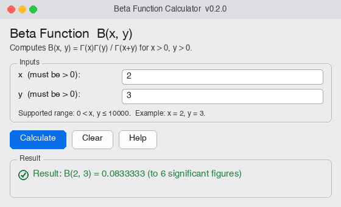
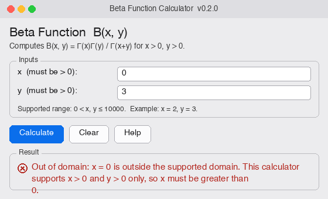

# Beta Function Calculator — SOEN 6011 (F6)

A user-centred scientific calculator that computes the real **Beta Function** `B(x, y)`
for positive real inputs (`x > 0`, `y > 0`), implemented **from scratch** (no math
library) with a **Tkinter graphical interface**.

- **Definition (Euler integral):** `B(x, y) = ∫₀¹ tˣ⁻¹(1−t)ʸ⁻¹ dt`
- **Symmetry:** `B(x, y) = B(y, x)`
- **Gamma identity (used):** `B(x, y) = Γ(x)·Γ(y) / Γ(x+y)`, evaluated in the log domain

Course: SOEN 6011 (Software Engineering Processes), Section CC, Summer 2026 · Individual
project · **Version 0.2.0** (Deliverable 2).

**Public repository:** `https://github.com/shobanbhowmik2/beta-function-calculator`

## Status

| Deliverable | State |
|---|---|
| D1 — Persona, requirements, algorithms, CLI prototype | ✅ Complete |
| D2 — From-scratch implementation + Tkinter GUI | ✅ Complete (this release, v0.2.0) |
| D3 — Style/tools/tests + poster | Planned |

## Requirements

- **Python 3** (developed on 3.14; any 3.8+ should work).
- **Tkinter** — bundled with the standard python.org installers and Homebrew `python-tk`.
  Verify with: `python3 -c "import tkinter; print(tkinter.TkVersion)"`.
- No third-party packages. The mathematics uses **no library** — see *From scratch* below.

## Running in GitHub Codespaces (no local install)

This repo ships a `.devcontainer` with a browser-accessible desktop, so the Tkinter GUI
is viewable without installing anything locally:

1. On GitHub, click **Code → Codespaces → Create codespace on main**.
2. Wait for the container to build; a **"Desktop (noVNC)"** port (6080) will auto-open
   in a new browser tab — that's a full Linux desktop rendered in-browser.
3. In the Codespace terminal, run `python3 src/gui.py`; the Tkinter window appears in
   the noVNC desktop tab.

## Running

Graphical interface (Deliverable 2):

```bash
python3 src/gui.py
```

Enter `x` and `y` (both `> 0`), press **Calculate** (or **Enter**). Press **Clear** (or
**Escape**) to reset, and **Help** (or **F1**) for usage. Runs from any terminal with a
plain Python 3 command — no IDE required.

Command-line prototype (Deliverable 1 baseline, retained for reference/regression):

```bash
python3 src/cli.py
```

### Usage examples

| Input | Result |
|---|---|
| `x = 2, y = 3` | `B(2, 3) = 0.0833333` (= 1/12) |
| `x = 0.5, y = 0.5` | `B(0.5, 0.5) = 3.14159` (= π) |
| `x = 10, y = 10` | `B(10, 10) = 1.08251e-06` |



### Error handling (helpful messages, never a traceback)

| Input | Message |
|---|---|
| `x = 0` or `x = -2` | *Out of domain:* “x … is outside the supported domain … must be greater than 0.” |
| `x = abc` | *Invalid number:* “x = 'abc' is not a number. Enter a decimal value such as 2, 0.5 or 3.75.” |
| `x` empty | *Input needed:* “x is empty. Enter a number greater than 0, for example 2.5.” |
| `x = 1e6` | *Out of range:* “x … exceeds the supported bound of 10000 …” |



## From scratch (Deliverable 2, Problem 5)

Apart from input/output, arithmetic, UI (Tkinter), and exception facilities, the
implementation uses **no built-in or library mathematical functions** — in particular no
`math`, `numpy`, `scipy`, and no `math.gamma`/`lgamma`/`beta`. The three transcendental
primitives are reimplemented from scratch in [`src/elementary.py`](src/elementary.py) via
range reduction plus convergent series:

- `ln(x)` — mantissa reduction + atanh series
- `exp(x)` — `k·ln2 + r` reduction + Taylor series
- `sin(x)` — argument reduction + Taylor series (used only by the `lnΓ` reflection)

Verified accurate to ≤ 6×10⁻¹⁵ against a trusted oracle. The Beta core reproduces the D1
accuracy exactly (worst relative error **1.17×10⁻¹⁴** over the reference table). Details:
[`docs/algorithms/d2_from_scratch_notes.md`](docs/algorithms/d2_from_scratch_notes.md) and
[`docs/algorithms/elementary_functions.md`](docs/algorithms/elementary_functions.md).

## Supported domain & assumptions

- Domain `x > 0` and `y > 0` (Euler integral finite and real) — **pending confirmation
  with the professor** (decision D-001).
- Supported magnitude `0 < x, y ≤ 1×10⁴`; larger inputs are rejected with a range message.
- Accuracy target: relative error ≤ 1×10⁻⁶ over `0 < x, y ≤ 50` (measured worst 1.17×10⁻¹⁴).
- No analytic continuation, complex arguments, or incomplete Beta (out of scope for D2).

## Testing

```bash
python3 tests/verify_d2.py     # D2: from-scratch boundary, accuracy, GUI, exceptions — 27/27
python3 tests/verify_d1.py     # D1 baseline regression — 15/15
```

`verify_d2.py` uses Python's `math` **only as a test oracle** to confirm the from-scratch
primitives; the shipped source imports no math library (checked by the harness, IMPL-01).
Full unit-test suite (PyUnit) is scheduled for Deliverable 3.

## Repository structure

```
src/
  elementary.py     # from-scratch ln, exp, sin, PI, is_finite   (D2)
  beta_core.py      # Lanczos lnΓ + log-domain Beta (pure core)   (D2)
  validation.py     # input parsing + helpful messages            (D2)
  exceptions.py     # BetaError typed hierarchy                    (D2)
  gui.py            # Tkinter GUI (entry point)                    (D2)
  cli.py            # D1 command-line prototype (retained baseline)
tests/
  verify_d2.py  verify_d1.py
docs/
  requirements/  algorithms/  mindmaps/  screenshots/  prompts/  decisions/
  persona.md  verification_matrix*.md  gui_wireframe.md  reference_values.csv  references.bib
deliverables/
  D1/  D2/  D3/     # LaTeX report, Beamer slides, PDFs, submission zips
CHANGELOG.md
```

## Versioning

Loosely follows Semantic Versioning (applied formally in D3): **0.1.0** = D1 CLI,
**0.2.0** = D2 from-scratch GUI. The version is shown in the GUI title bar.

## Authorship, GAI use & attribution

Individual work. Generative-AI (LLM) tools are used per course constraint C-03 with
CASTROFF-based prompts; every prompt and its critical evaluation are recorded in
[`docs/prompts/gai_prompt_log.md`](docs/prompts/gai_prompt_log.md). Non-original work is
cited in [`docs/references.bib`](docs/references.bib) (ISO/IEC/IEEE 29148; Lanczos;
Muller; Cody & Waite; NIST DLMF; Abramowitz & Stegun; Cooper). Commit messages follow
imperative, single-purpose conventions; the changelog follows *Keep a Changelog*.

## Publishing this repository (Problem 6)

```bash
git init                         # already initialised in this working copy
gh repo create beta-function-calculator --public --source=. --remote=origin --push
# or manually:
git remote add origin https://github.com/<you>/beta-function-calculator.git
git branch -M main && git push -u origin main
```

Then replace `<PUBLIC-REPO-URL>` above with the resulting address and confirm it loads in
a logged-out browser.
